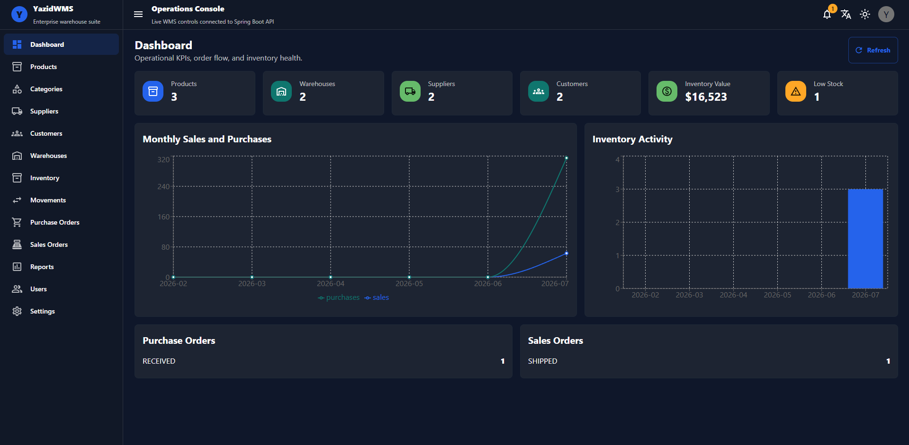
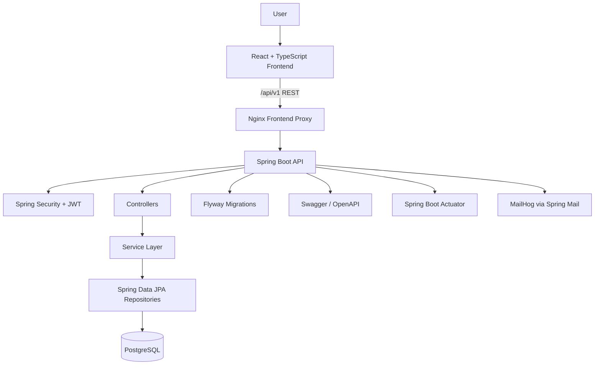

# YazidWMS

**A full-stack enterprise Warehouse Management System built with Java, Spring Boot, React, TypeScript, PostgreSQL, and Docker.**

[](https://github.com/Dizay1957/yazidwms/actions/workflows/ci.yml)


<!-- Add dashboard screenshot here after capturing it:

-->

YazidWMS is a production-style warehouse and inventory management platform. It manages products, categories, suppliers, customers, warehouses, storage locations, inventory quantities, stock movements, purchase orders, sales orders, operational reports, authentication, role-based authorization, and audit-friendly history.

## Key Features

### Inventory Management

- Product and category management
- Multi-warehouse topology with zones, aisles, shelves, and bins
- Inventory quantities by product and bin
- Stock adjustments, transfers, receiving, and issuing
- Immutable stock movement history
- Low-stock monitoring and notifications

### Purchasing

- Supplier management
- Purchase order creation, confirmation, receiving, and cancellation
- Automatic inventory increase when purchase orders are received

### Sales

- Customer management
- Sales order creation, confirmation, shipping, and cancellation
- Stock validation before shipping
- Automatic inventory decrease when sales orders are shipped

### Administration

- JWT authentication with refresh tokens
- Role-based backend security and protected frontend routes
- User management for administrators
- Profile and password management
- Audit logging for important operational events

### Reporting

- Dashboard KPIs and charts from live backend data
- CSV, Excel, and PDF exports
- Inventory valuation, low-stock, purchase order, sales order, and stock movement reports

## Engineering Highlights

- Transactional stock operations keep inventory, product quantities, and stock movement records consistent.
- Negative inventory is prevented during product issuing, bin issuing, sales order confirmation, and transfer workflows.
- JWT access tokens and persisted refresh tokens support stateless API authentication.
- Role-based endpoint security protects users, reports, audit logs, and authenticated business APIs.
- Flyway migrations create and version the PostgreSQL schema.
- DTOs and MapStruct mappers keep API contracts separate from JPA entities.
- Global exception handling returns consistent API error responses.
- Pagination is used across list endpoints and frontend data grids.
- Inventory movement history is append-only from the application workflow perspective.
- Docker Compose runs the API, frontend, PostgreSQL, pgAdmin, and MailHog together.
- Spring Boot Actuator exposes health and operational endpoints.

## Technology Stack

| Area | Technologies |
| --- | --- |
| Backend | Java 21, Spring Boot 3.3.5, Maven |
| Security | Spring Security, JWT, BCrypt |
| Persistence | Spring Data JPA, Hibernate |
| Database | PostgreSQL 16, Flyway |
| Frontend | React 18, TypeScript, Vite, Material UI |
| Data UI | MUI Data Grid, Recharts |
| API | REST, Swagger/OpenAPI |
| Mapping | MapStruct |
| Reports | OpenCSV, Apache POI, OpenPDF |
| Testing | JUnit 5, Mockito, Spring Boot Test, H2 test database, JaCoCo |
| Infrastructure | Docker, Docker Compose, Nginx |
| Development tools | pgAdmin, MailHog |
| Monitoring | Spring Boot Actuator |

## Architecture



YazidWMS uses a modular monolith architecture. Business areas are separated into packages such as `product`, `inventory`, `purchaseorder`, `salesorder`, `warehouse`, `report`, `audit`, and `user`, while still deploying as one Spring Boot application. This keeps the codebase maintainable without introducing unnecessary distributed-system complexity.

See [docs/architecture.md](docs/architecture.md) for deeper architecture notes and workflow diagrams.

## Backend Architecture

```text
src/main/java/com/yazidwms
|-- audit
|-- auth
|-- category
|-- common
|-- config
|-- customer
|-- dashboard
|-- exception
|-- inventory
|-- notification
|-- product
|-- purchaseorder
|-- report
|-- role
|-- salesorder
|-- security
|-- stockmovement
|-- supplier
|-- user
`-- warehouse
```

Backend layers:

- Controllers expose REST endpoints under `/api/v1`.
- Services contain transactional business workflows.
- Repositories provide Spring Data JPA persistence.
- Entities model persisted warehouse, user, order, and inventory data.
- DTOs define API request and response shapes.
- Mappers convert between entities and DTOs with MapStruct.
- Security configures JWT authentication, password hashing, protected routes, and rate limiting.
- Configuration contains OpenAPI, seeding, and application setup.
- Exception handling centralizes API error responses.

## Frontend Architecture

```text
frontend/src
|-- api
|-- app
|-- auth
|-- components
|-- features
|-- hooks
|-- i18n
|-- layouts
|-- pages
|-- routes
|-- types
`-- utils
```

The frontend uses React Router for routing, protected routes for authenticated and role-based areas, Axios for `/api/v1` requests, React Query for server-state fetching and cache invalidation, Material UI for the interface, MUI Data Grid for data tables, and TypeScript models for API contracts. Authentication stores access tokens in `sessionStorage`, refresh tokens in `localStorage`, and refreshes expired access tokens through the API client.

## Example Business Workflow

1. An administrator creates a warehouse and storage locations.
2. A manager or authenticated operator creates suppliers, categories, and products.
3. A purchase order is created and confirmed.
4. The purchase order is received.
5. Inventory increases automatically and stock movements are recorded.
6. A customer and sales order are created.
7. The sales order is confirmed and shipped after stock validation.
8. Inventory decreases automatically.
9. Stock movements, dashboard metrics, reports, and audit records preserve the operational history.

## Role and Permission Matrix

The backend confirms the following access rules in `SecurityConfig` and method-level annotations. The frontend also protects the reports and users routes.

| Feature | Admin | Manager | Warehouse Operator | Viewer |
| --- | --- | --- | --- | --- |
| Login and refresh token | Yes | Yes | Yes | Yes |
| View dashboard | Yes | Yes | Yes | Yes |
| Manage products, categories, suppliers, customers, warehouses, inventory, and orders | Yes | Yes | Yes | Yes |
| View/download reports | Yes | Yes | No | No |
| View audit log endpoint | Yes | Yes | No | No |
| Manage users | Yes | No | No | No |
| View roles endpoint | Yes | No | No | No |
| View/update own profile | Yes | Yes | Yes | Yes |

## Prerequisites

For Docker:

- Docker
- Docker Compose v2 using `docker compose`

For local development:

- Java 21
- Maven
- Node.js 22 or another modern Node.js version compatible with Vite 8
- npm
- PostgreSQL, or the Docker Compose PostgreSQL service

## Quick Start With Docker

```bash
git clone https://github.com/Dizay1957/yazidwms.git
cd yazidwms
cp .env.example .env
docker compose up --build
```

Available URLs:

- Frontend: `http://localhost:5173`
- Backend API: `http://localhost:8081/api/v1`
- Swagger UI: `http://localhost:8081/swagger-ui.html`
- Actuator health: `http://localhost:8081/actuator/health`
- pgAdmin: `http://localhost:5050`
- MailHog: `http://localhost:8025`
- PostgreSQL host port: `localhost:5434`

Development-only demo credentials are configured through `.env` using `SEED_ADMIN_EMAIL` and `SEED_ADMIN_PASSWORD`.

## Local Development

Start only the supporting services:

```bash
docker compose up -d postgres mailhog pgadmin
```

Run the backend from the repository root:

```bash
$env:SPRING_PROFILES_ACTIVE="dev"
$env:SERVER_PORT="8081"
$env:DB_HOST="localhost"
$env:DB_PORT="5434"
$env:DB_NAME="yazidwms"
$env:DB_USERNAME="yazid"
$env:DB_PASSWORD="<your-local-db-password>"
$env:JWT_SECRET="<your-local-jwt-secret-at-least-32-characters>"
$env:SEED_ADMIN_EMAIL="<your-local-admin-email>"
$env:SEED_ADMIN_PASSWORD="<your-local-admin-password>"
mvn spring-boot:run
```

Run the frontend:

```bash
cd frontend
npm install
$env:VITE_API_PROXY_TARGET="http://127.0.0.1:8081"
npm run dev
```

Frontend development URL:

```text
http://localhost:5173
```

## Environment Variables

Root `.env.example` contains safe placeholder values for Docker and local development.

| Variable | Description | Example |
| --- | --- | --- |
| `POSTGRES_DB` | PostgreSQL database created by Docker | `yazidwms` |
| `POSTGRES_USER` | PostgreSQL Docker user | `yazid` |
| `POSTGRES_PASSWORD` | PostgreSQL Docker password | `change-this-postgres-password` |
| `PGADMIN_DEFAULT_EMAIL` | pgAdmin login email | `admin@example.com` |
| `PGADMIN_DEFAULT_PASSWORD` | pgAdmin login password | `change-this-pgadmin-password` |
| `SPRING_PROFILES_ACTIVE` | Spring profile | `dev` |
| `SERVER_PORT` | Backend server port for local runs | `8081` |
| `DB_HOST` | Database host used by the API | `postgres` or `localhost` |
| `DB_PORT` | Database port used by the API | `5432` in Docker, `5434` from host |
| `DB_NAME` | Application database name | `yazidwms` |
| `DB_USERNAME` | Application database user | `yazid` |
| `DB_PASSWORD` | Application database password | `change-this-postgres-password` |
| `JWT_SECRET` | JWT signing secret | `replace-with-a-long-random-secret` |
| `JWT_ACCESS_MINUTES` | Access token lifetime in minutes | `30` |
| `JWT_REFRESH_DAYS` | Refresh token lifetime in days | `7` |
| `RATE_LIMIT_PER_MINUTE` | Per-IP request limit | `120` |
| `SEED_ADMIN_EMAIL` | First admin email seeded at startup | `admin@example.com` |
| `SEED_ADMIN_PASSWORD` | First admin password seeded at startup | `change-this-admin-password` |
| `SEED_DEMO_DATA` | Whether demo business data is seeded | `false` |
| `NOTIFICATION_ADMIN_EMAIL` | Notification recipient | `admin@example.com` |
| `MAIL_HOST` | SMTP host | `mailhog` |
| `MAIL_PORT` | SMTP port | `1025` |
| `SWAGGER_ENABLED` | Enables Swagger/OpenAPI endpoints | `true` in dev |

The frontend also supports `frontend/.env.example` with `VITE_API_PROXY_TARGET` for local Vite proxy configuration.

## Testing

Backend tests:

```bash
mvn test
```

Full Maven verification, including JaCoCo report generation:

```bash
mvn verify
```

JaCoCo report path:

```text
target/site/jacoco/index.html
```

Frontend production build:

```bash
cd frontend
npm ci
npm run build
```

The frontend currently has no `lint` or `test` npm script, so CI runs the production build only.

Docker configuration validation:

```bash
docker compose config
```

Docker image build:

```bash
docker compose build api frontend
```

## Security

YazidWMS uses Spring Security with stateless JWT authentication. Access tokens are signed with `JWT_SECRET`, refresh tokens are stored server-side and can be revoked on logout, passwords are hashed with BCrypt, and protected endpoints require authentication. Admin-only and manager-only areas are enforced in backend security configuration and frontend protected routes.

Swagger is enabled in development and disabled by the `prod` Spring profile. Real deployments should provide strong secrets through environment variables, use HTTPS, restrict CORS and Swagger visibility, harden token storage, configure production SMTP, and avoid committing `.env` files.

## Deployment Notes

The current Docker Compose setup is designed for development and portfolio demonstration. Production deployment should add strong secrets, HTTPS, a managed PostgreSQL instance or hardened database host, restricted CORS, disabled public Swagger, reverse proxy hardening, database backups, centralized logging, monitoring, a real mail provider, and environment-specific rate limits.

## Screenshots

Screenshots are not committed yet. See [docs/screenshots/README.md](docs/screenshots/README.md) for the capture checklist and file names.

## GitHub Setup

Repository metadata, topics, branch protection, and release recommendations are documented in [docs/github-setup.md](docs/github-setup.md).
