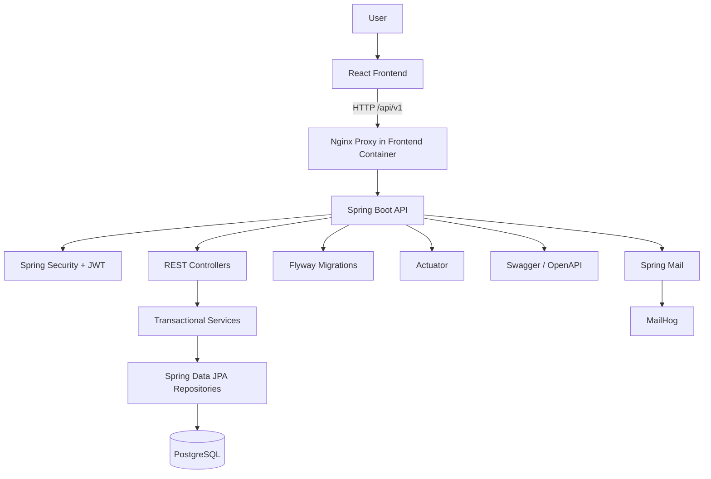
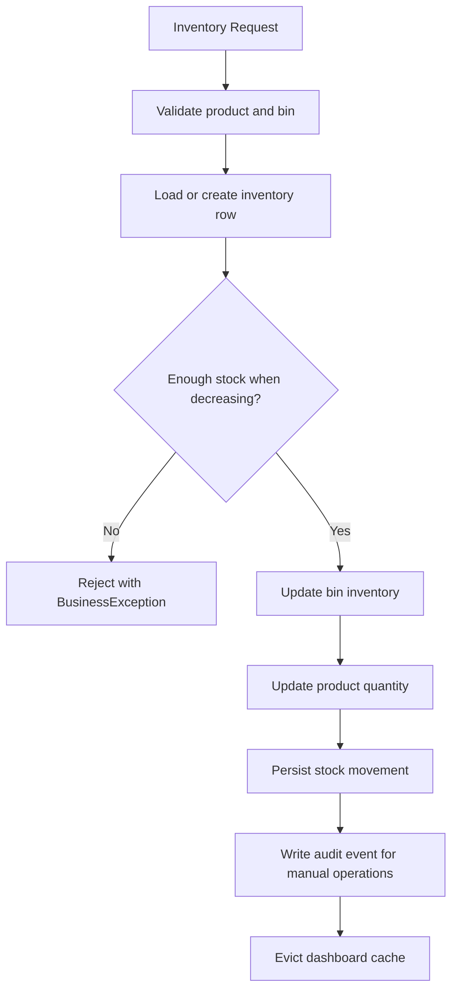
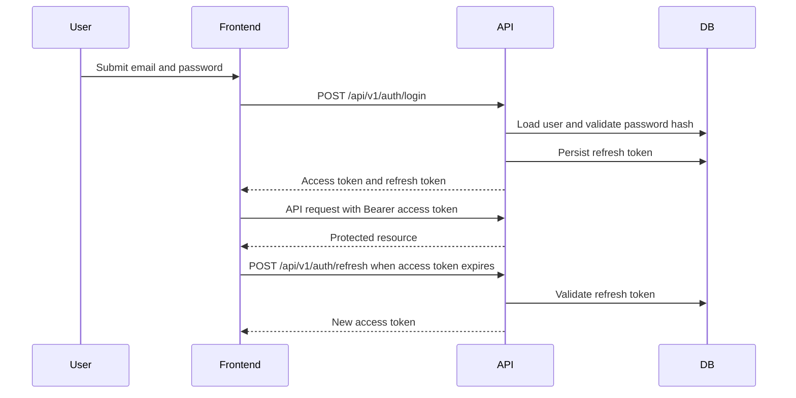
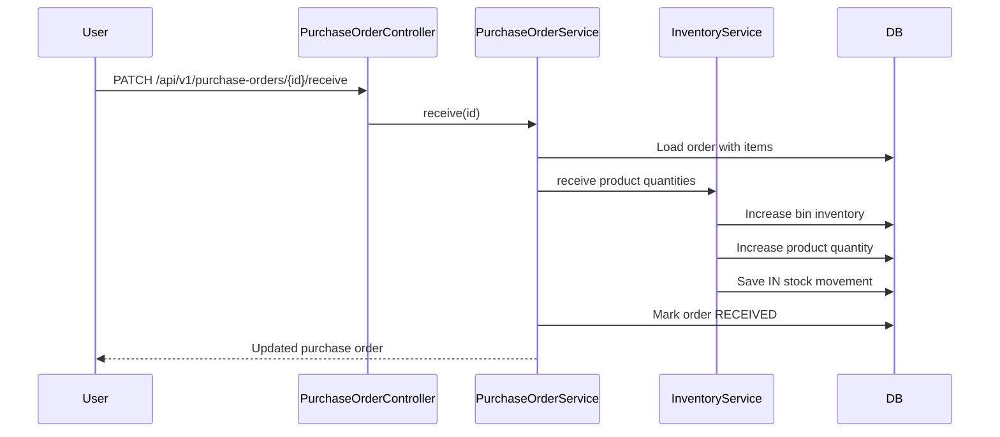
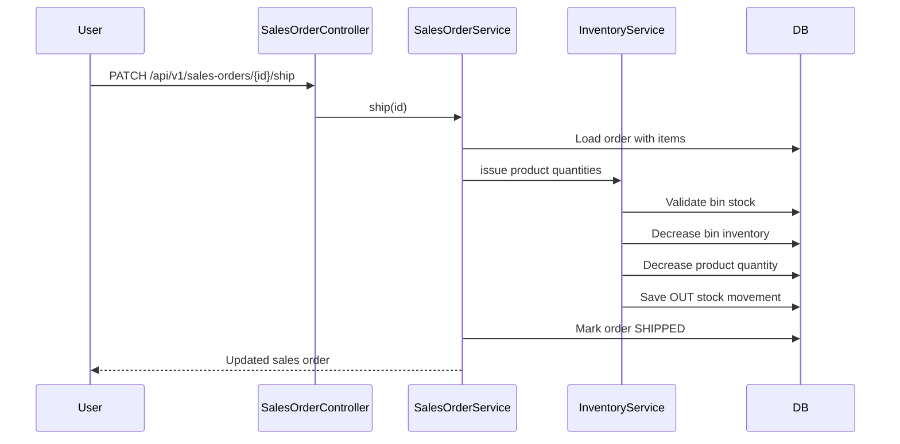

# YazidWMS Architecture

YazidWMS is a modular monolith. It is deployed as one Spring Boot API and one React frontend, but the backend code is split by business capability: authentication, users, products, inventory, purchasing, sales, warehouse topology, reporting, audit, and shared infrastructure.

This design keeps deployment simple while still making the codebase maintainable. It avoids distributed-system complexity until the product has a real reason to split services.

## System Overview

## Backend Layers

- Controllers expose REST endpoints under `/api/v1`.
- Services hold business rules and transaction boundaries.
- Repositories use Spring Data JPA for persistence.
- Entities map the relational model.
- DTOs define request and response contracts.
- MapStruct mappers translate between entities and DTOs.
- Security filters handle rate limiting and JWT authentication.
- Exception handling produces consistent API errors.

## Frontend Architecture

The frontend is a Vite React application. React Router defines public and protected routes, Axios sends API requests to `/api/v1`, React Query manages server state, Material UI provides the component system, and MUI Data Grid powers management tables. Authentication state is stored by `tokenStore`, with access tokens in `sessionStorage` and refresh tokens in `localStorage`.

## Database Responsibilities

PostgreSQL stores users, roles, refresh tokens, activation tokens, password reset tokens, products, categories, suppliers, customers, warehouses, storage locations, inventory, stock movements, purchase orders, sales orders, audit events, and notification logs. Flyway owns schema creation through `src/main/resources/db/migration`.

## Inventory Transaction Flow

Manual adjustments and transfers are handled by `InventoryService`. Purchase-order receiving and sales-order shipping reuse the same inventory service so stock changes are recorded consistently.

## JWT Authentication Flow

## Purchase Order Receiving Flow

## Sales Order Shipping Flow

## Audit Logging

Audit events are persisted for authentication, user lifecycle, product updates, inventory adjustments, and transfers. Audit data is exposed through `/api/v1/audit` for users with `ADMIN` or `MANAGER` roles.

## Docker Environment

Docker Compose starts:

- `postgres` on host port `5434`
- `api` on host port `8081`
- `frontend` on host port `5173`
- `pgadmin` on host port `5050`
- `mailhog` on host ports `1025` and `8025`
